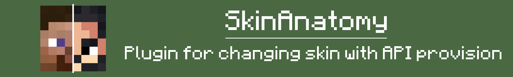
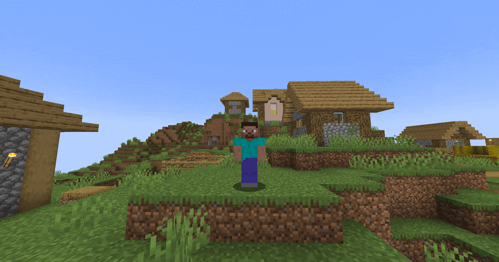

# SkinAnatomy Plugin

SkinAnatomy is a plugin for Minecraft that allows users to edit every part of a player's skin. This plugin provides an API for interacting with the skin at the code level, as well as integration with Imgur for convenient storage and use of skins.
## Demonstration

## Capabilities

- Editing each part of the player’s skin (head, body, arms, legs).
- Ability to edit different sides of skin parts (left, right).
- Integration with Imgur for convenient storage of skins.
- Support for commands and permissions to control the functionality of the plugin.

## Commands

| Команда | Описание |
| ------- | -------- |
| `/skinanatomy` | Shows information about the plugin and available commands. |

## Permissions

- `skinanatomy.use` - allows the use of basic plugin functions.
- `skinanatomy.admin` - provides access to all functions and settings of the plugin.

## Install

1. Download the latest version of the plugin.
2. Place the plugin file in the `plugins` folder of your server.
3. Restart the server.

## Settings

The plugin uses the `config.yml` and `plugin.yml` files to configure messages, skin URLs and other parameters. You can read more about the configuration in the corresponding configuration files.
## API

SkinAnatomy provides an API for interacting with skins at the code level. To use the API, refer to the `SkinAnatomyAPI` class.