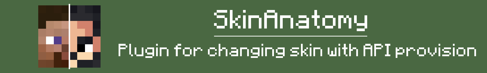
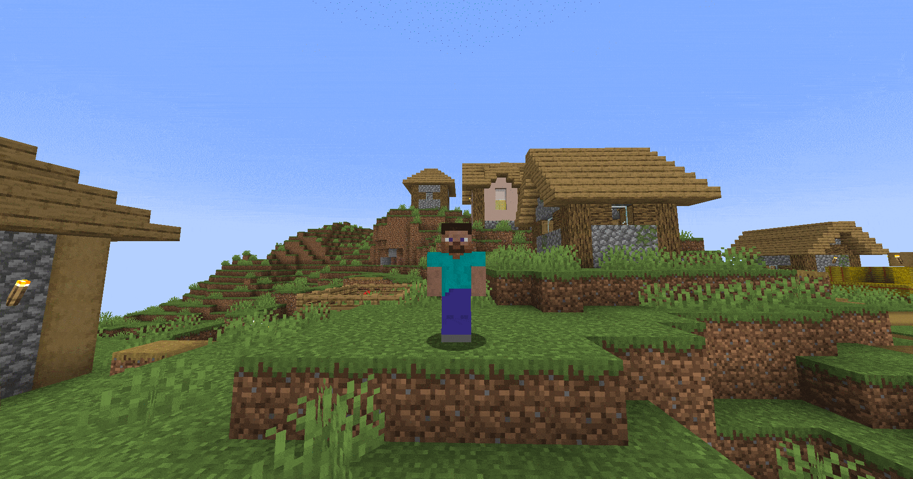

# SkinAnatomy



SkinAnatomy is a small, framework-agnostic **Kotlin library** for editing and composing
Minecraft player skin textures. It has no dependency on Bukkit, Paper, or any specific
Minecraft server API - it only deals with the 64x64 skin image itself, so you can use it
in a plugin, a bot, a web service, or a standalone tool.

It lets you address a skin by its anatomical parts - head, body, left/right arm, left/right
leg - by side (front, back, left, right, top, bottom) and by layer (the base one, or the
overlay: hat, jacket, sleeves, pants), edit any of those regions in
place or graft one part from another skin, and render the result back out as a normal
`BufferedImage`. Legacy 64x32 skins (pre-1.8, no overlay layer) are transparently upgraded
to the modern 64x64 layout.

What you do with the resulting texture - upload it, sign it through something like
[SkinsRestorer](https://skinsrestorer.net)'s MineSkin integration, apply it to a player -
is up to the consuming project; this library is deliberately scoped to just the image side
of the problem.



## Adding it to your project

Published to Maven Central from 2.1.1 on:

```kotlin
repositories {
    mavenCentral()
}

dependencies {
    implementation("io.github.dverkask:skinanatomy:2.1.1")
}
```

Older versions (up to `v2.1.0`) exist only on [JitPack](https://jitpack.io/#DverkaSK/SkinAnatomy),
as `com.github.DverkaSK:SkinAnatomy:<tag>` from `maven("https://jitpack.io")`.

### Releasing

Step by step, with the one-time setup and the pitfalls already hit: [RELEASING.md](RELEASING.md).
In short - `./gradlew publishToMavenCentral` stages the upload, a human presses **Publish**
at <https://central.sonatype.com/publishing>, and a Central release can never be deleted or
replaced.

### Local development

Working on SkinAnatomy and another project at the same time? Skip publishing entirely with a
composite build - point the other project's `settings.gradle.kts` at this repo's
directory and Gradle substitutes the dependency with the local sources, no publish step:

```kotlin
includeBuild("../SkinAnatomy")
```

Or publish a snapshot to your local Maven cache instead:

```bash
./gradlew publishToMavenLocal
```

then depend on `mavenLocal()`:

```kotlin
repositories { mavenLocal() }
dependencies { implementation("io.github.dverkask:skinanatomy:2.1.1") }
```

## Usage

```kotlin
import ru.dverkask.skinanatomy.api.skin.PlayerSkin
import ru.dverkask.skinanatomy.api.enums.SkinLayer
import ru.dverkask.skinanatomy.api.enums.SkinPartType

// Load once - every part below shares this same in-memory canvas.
val skin = PlayerSkin.fromUrl("https://textures.minecraft.net/texture/...")
// or: PlayerSkin.fromImage(existingBufferedImage)

// Edit a region in place, or return a different BufferedImage - both are supported.
skin.head.processImage { image ->
    image // mutate via image.graphics, or return a brand-new BufferedImage
}

// Or edit the overlay layer (hat, jacket, sleeves, pants) instead of the base one.
skin.body.processImage({ image -> image }, SkinLayer.OVERLAY)

// Graft an entire part (all six sides, both layers) from another skin.
val other = PlayerSkin.fromUrl("https://example.com/other-skin.png")
skin.copyPartFrom(other, SkinPartType.HEAD)

// Or graft just one layer - e.g. take someone's face but keep this skin's hat.
skin.copyPartFrom(other, SkinPartType.HEAD, setOf(SkinLayer.BASE))

// Get the composed 64x64 texture back out.
val texture: java.awt.image.BufferedImage = skin.render()
```

### API surface

- `PlayerSkin` - loads a skin (`fromUrl` / `fromImage`) and exposes `head`, `body`,
  `leftArm`, `rightArm`, `leftLeg`, `rightLeg`, plus `part(SkinPartType)`, `copyPartFrom`
  and `render()`.
- `ISkinPart` - `type`, `sides`, `overlaySides`, `sides(SkinLayer)`,
  `getImage(SkinSide[, SkinLayer])`, `processImage(ImageProcessor[, SkinLayer])`. Without a
  layer argument, `getImage` and `processImage` work on the base layer.
- `SkinPartType` / `SkinSide` / `SkinLayer` - the six anatomical parts, the six faces of
  each, and the two layers (`BASE`, `OVERLAY`).
- `ImageLoader` - loads a texture from a URL via `java.net.http.HttpClient`.

## Building from source

```bash
./gradlew build
```

Requires JDK 21+ (a matching toolchain is auto-provisioned via Gradle if none is found).

## License

[MIT](LICENSE).
